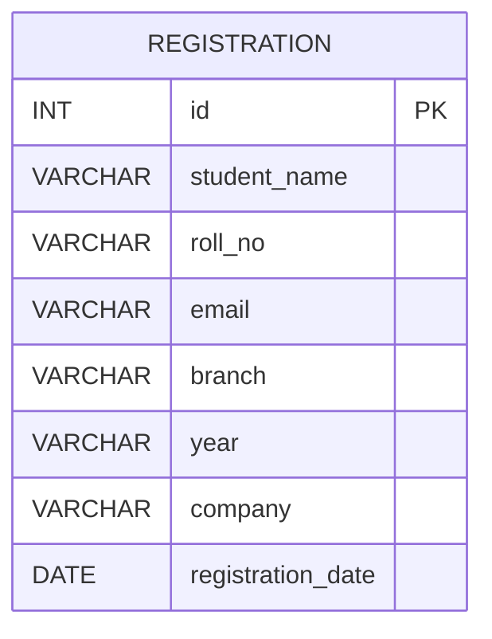

# ER Diagram

## Description
This project currently uses a single table named `registrations`.
Each record represents one student registration for a company placement drive.

- `id` is the primary key
- `student_name` stores the student name
- `roll_no` stores the student roll number
- `email` stores the student email
- `branch` stores the department/branch
- `year` stores the academic year
- `company` stores the company name
- `registration_date` stores the registration date
