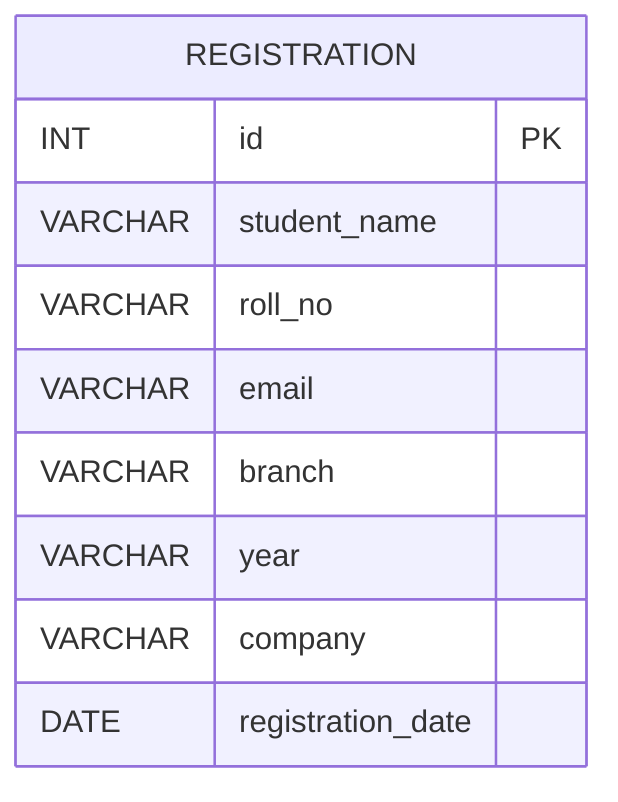

# Placement Drive Management System

## 1. Introduction
The Placement Drive Management System is a web-based project designed to help colleges manage student registrations for campus placement drives. The system allows students to register for upcoming companies and allows administrators to view or filter student registrations.

The project is built using:
- HTML for structure
- CSS for styling
- JavaScript for front-end behavior
- PHP for server-side processing
- MySQL for data storage

## 2. Objective
The main objective of the project is to simplify and organize the placement registration process. It helps to:
- collect student registration details
- store data in a database
- display all registrations
- filter registrations by company
- reduce manual work and paperwork

## 3. Problem Statement
In many colleges, placement registrations are managed manually, which can lead to errors, duplicate entries, and difficulty in tracking students. This project provides a digital solution to record and monitor placement registrations efficiently.

## 4. Existing System
The system currently supports the following features:
- Student registration form
- Validation for required fields and email format
- Insertion of student data into the database
- Display of all registered students
- Filter by company name
- Reset filter option

## 5. Proposed System
The proposed system is a simple and effective web application that allows students to enter their details and submit them online. The data is stored in a MySQL database and can be retrieved in a table form for viewing and filtering.

## 6. Functional Requirements
The system should:
- allow a student to enter name, roll number, email, branch, year, company, and registration date
- validate empty fields
- verify email format
- insert the form data into the database
- show a success or failure message
- display the registered students in a table
- filter the table by company name

## 7. Non-Functional Requirements
- user-friendly interface
- quick and responsive form interaction
- secure handling of form data
- accurate database storage
- easy maintenance and scalability

## 8. Technologies Used
### Frontend
- HTML
- CSS
- JavaScript

### Backend
- PHP
- MySQL

### Tools
- XAMPP
- Apache Server
- MySQL Database
- VS Code

## 9. Project Modules
### 9.1 Registration Page
This page contains a form where students fill in their details and submit them for placement registration.

### 9.2 Server-Side Validation
PHP checks whether all required fields are filled and validates the email before inserting records.

### 9.3 Database Storage
Student data is saved in the `registrations` table in MySQL.

### 9.4 View Registrations Page
This page fetches and displays all student registrations from the database.

### 9.5 Filter Option
Users can filter the registrations by selecting a company name from the dropdown list.

## 10. Database Design
The project currently uses a single table named `registrations`.

### Table: registrations
| Field Name | Data Type | Description |
|---|---|---|
| id | INT | Unique record ID |
| student_name | VARCHAR(100) | Student's name |
| roll_no | VARCHAR(30) | Student roll number |
| email | VARCHAR(100) | Student email address |
| branch | VARCHAR(50) | Student branch |
| year | VARCHAR(20) | Student academic year |
| company | VARCHAR(50) | Company name |
| registration_date | DATE | Registration date |

## 11. Entity Relationship Diagram (ERD)

## 12. System Workflow
1. Student opens the registration page.
2. Student fills the form with required data.
3. The form is submitted to the PHP backend.
4. PHP validates the fields and email.
5. If valid, the data is inserted into the MySQL database.
6. The system displays a success message.
7. The admin can view all registrations and filter them by company.

## 13. Advantages
- easy to use
- saves time
- reduces manual effort
- helps maintain accurate records
- simple and cost-effective solution

## 14. Limitations
- currently supports only basic registration features
- no login system for admin
- no advanced reporting or export features
- no role-based access control

## 15. Future Enhancements
- add admin login
- add student login
- add company management
- generate reports in PDF/Excel
- add search functionality
- add duplicate prevention checks
- add email notifications

## 16. Conclusion
The Placement Drive Management System is a practical and efficient solution for managing placement registrations. It simplifies the process of collecting and organizing student data and helps institutions manage placement drives more effectively.

## 17. References
- HTML Documentation
- CSS Documentation
- JavaScript Documentation
- PHP Manual
- MySQL Documentation

## 18. Project Developer
This project is developed as a placement drive management application for academic or college use.
